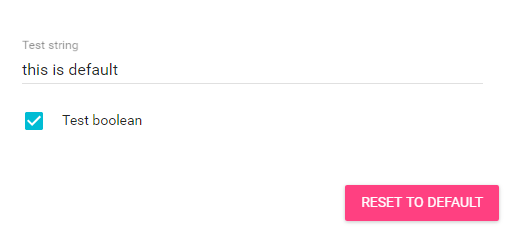

# preferences.json Format

Hain supports Plugin Preferences by `preferences.json` using JSONSchema.  
You can put your `preferences.json` into your plugin folder, then it works.  
and You can open Preferences Dialog by entering `/preferences` in Hain.

See <http://json-schema.org/> for JSONSchema

**Example**  

You can make your plugin preferences like:
<p align="center">
  
</p>

by following JSONSchema:
```json
{
  "type": "object",
  "properties": {
    "testStr": {
      "type": "string",
      "title": "Test string",
      "default": "this is default"
    },
    "testBool": {
      "type": "boolean",
      "title": "Test boolean",
      "default": true
    }
  }
}
```

and You can access the preferences via `PluginContext.preferences` such as:

```javascript
'use strict'

module.exports = (pluginContext) => {
  const logger = pluginContext.logger;
  const prefObj = pluginContext.preferences;
  
  const pref = prefObj.get();
  logger.log(pref.testStr);
  logger.log(pref.testBool);
  
  // or
  logger.log(prefObj.get('testStr'));
  logger.log(prefObj.get('testBool'));
  
  function startup() { ... }
  function search(query, res) { ... }
  function execute(id, payload) { ... }
  
  return { startup, search, execute };
};
```
See [PreferencesObject](preferences-object.md)

## Limitations  
Currently, Type of root object must be `object`.


## Related Docs
* [Plugin Skeleton](plugin-skeleton.md)
* [PreferencesObject](preferences-object.md)